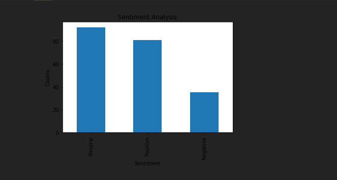

# Sentimental_analysis

## OVERVIEW

Sentimental analysis involves finding access token keys from twitter developer website and analysis of the duplicate tweets for particular word and analyse its polarity and subjectivity.

## Tweepy Keys
https://towardsdatascience.com/tweepy-for-beginners-24baf21f2c25

Output 
Showing negative, positive and neutral tweets of the particular day mentioned in the code.

# The particular output is for Covid-19.
